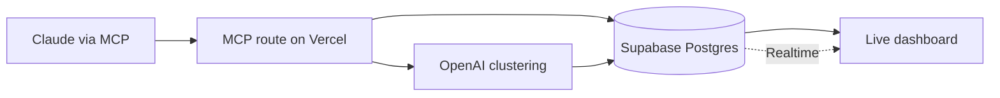

# Agent Wishlist

Agents hit a wall, work around it, and move on. The missing tool, permission, or dataset never becomes a ticket, so nobody learns what to build next.

Agent Wishlist gives an agent a way to say "I wish I had X" the moment it gets stuck. A live dashboard clusters those wishes and ranks them, so a human can see the capability worth building.

The agent in the demo is Claude, connected over MCP.

## How it fits together

- **Supabase Postgres** stores wishes and clusters. Row level security lets the anon key read both tables. Inserts and updates go through server code with the service role key.
- **Supabase Realtime** pushes new wishes and cluster changes to the dashboard.
- **Vercel** hosts the Next.js app and the MCP server, through the `mcp-handler` adapter at `/api/mcp/mcp`.
- **OpenAI** groups wishes that ask for the same capability and writes a short title for each cluster.

## Setup

1. Install dependencies: `npm install`
2. Copy `.env.example` to `.env.local` and fill in the Supabase URL, anon key, service role key, OpenAI key, and an `MCP_API_KEY` you invent. Do not commit `.env.local`.
3. In the Supabase SQL editor, run `supabase/schema.sql`.
4. Start the app: `npm run dev`
5. Load sample wishes: `npx tsx scripts/seed.ts`
6. Open [http://localhost:3000](http://localhost:3000)

## Connect your agent

The demo agent is Claude, connected to this app over MCP.

1. Open `/connect` for the MCP URL, which is this site's origin plus `/api/mcp/mcp`.
2. Paste the config into Claude Desktop (`~/Library/Application Support/Claude/claude_desktop_config.json`) or Cursor (`~/.cursor/mcp.json`). It runs `mcp-remote` and sends `Authorization: Bearer` with your `MCP_API_KEY`.
3. Add this to the agent's instructions: "If you can't complete a task because of a missing tool, permission, or data, call file_wish before giving up."

The server exposes three tools:

- `file_wish` files a missing tool, permission, or dataset.
- `list_top_wishes` checks whether another agent already asked for it.
- `upvote_wish` adds support to an existing cluster.
